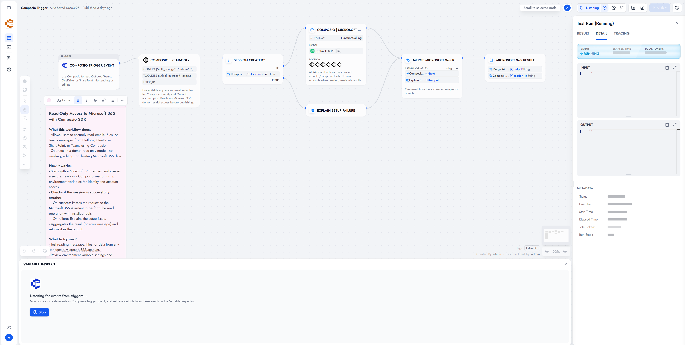

# Composio Trigger

Receive verified Composio trigger events in Dify workflows. One project webhook subscription per Dify trigger subscription, HMAC-SHA256 signatures, 300-second replay window.

**Source:** [https://github.com/erbanku/composio-trigger](https://github.com/erbanku/composio-trigger)

**Contact:** [GitHub issues](https://github.com/erbanku/composio-trigger/issues)

## Overview

Use this when an app event in Composio should start a Dify workflow. The companion [Composio](https://github.com/erbanku/composio) tool plugin is for outbound actions. This package only handles inbound events.

## Setup

1. Install **Composio Trigger** from the Dify Plugin Marketplace (or from this repository's package).
2. Configure your Composio project **API key**.
3. Keep the Composio **webhook secret** in Dify credentials. Do not put it in payloads or URLs. If you leave it empty, the secret returned when the subscription is created is stored for you.
4. Create the Composio trigger instance in Composio (user ID, trigger type slug, config, optional connected-account ID).
5. Let Dify create the webhook subscription. The plugin registers `composio.trigger.message` and `composio.connected_account.expired`.

The Composio project webhook URL must be publicly reachable. Composio signs requests with `webhook-id`, `webhook-timestamp`, and `webhook-signature`.

### Use the trigger

Add this trigger to a **Workflow** (or Chatflow that supports triggers). Filter on trigger slug or connected account if you need a narrower subscription.

## Screenshots

## Events

|           Event           |            Composio type             |                          Use                          |
| :-----------------------: | :----------------------------------: | :---------------------------------------------------: |
|      Trigger Message      |      `composio.trigger.message`      |        App event payload plus trigger metadata        |
| Connected Account Expired | `composio.connected_account.expired` | Reconnect or notify without using expired credentials |

Usage details

Unknown Composio project events get a 200 acknowledgement and are not dispatched, so retry storms do not start for lifecycle events this plugin does not expose.

Subscription create: `POST /api/v3.1/webhook_subscriptions`. Unsubscribe: `DELETE /api/v3.1/webhook_subscriptions/{id}`. Refresh is a no-op. Trigger instance create/enable/disable/delete stay in Composio.

This plugin does not create or delete trigger instances for you. Pick the exact toolkit trigger slug and config in Composio first.

Limits and security

- Rejects missing headers, bad signatures, old timestamps, malformed JSON, oversized bodies, and trigger messages without a user ID.
- Use a dedicated API key with only the trigger permissions you need.
- No automatic retries after Dify dispatch failures. Composio retries per its delivery policy.
- Rotate the webhook secret if it leaks, then update Dify credentials and recreate the subscription.

See [PRIVACY.md](./PRIVACY.md).

References

- [Triggers](https://docs.composio.dev/docs/triggers)
- [Subscribing to events](https://docs.composio.dev/docs/setting-up-triggers/subscribing-to-events)
- [Webhook subscriptions API](https://docs.composio.dev/reference/api-reference/webhook-subscriptions)

Independent plugin under the `erbanku` namespace. Not an official Composio product.

